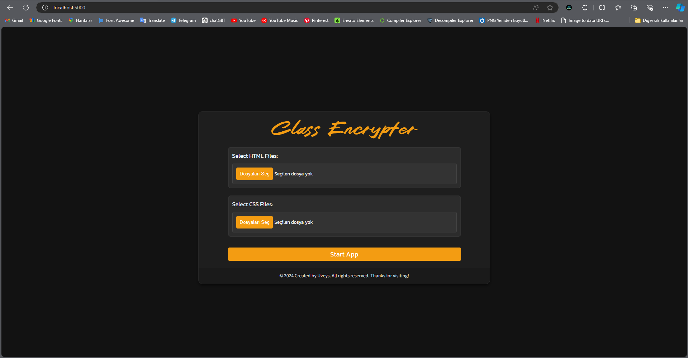
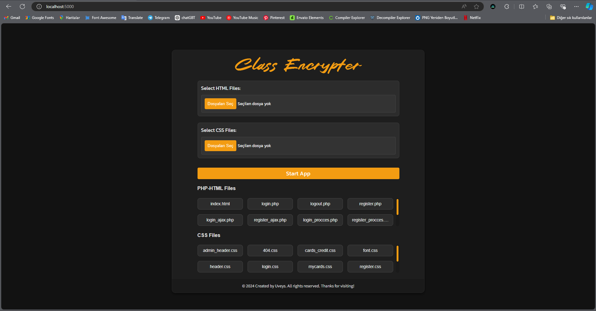
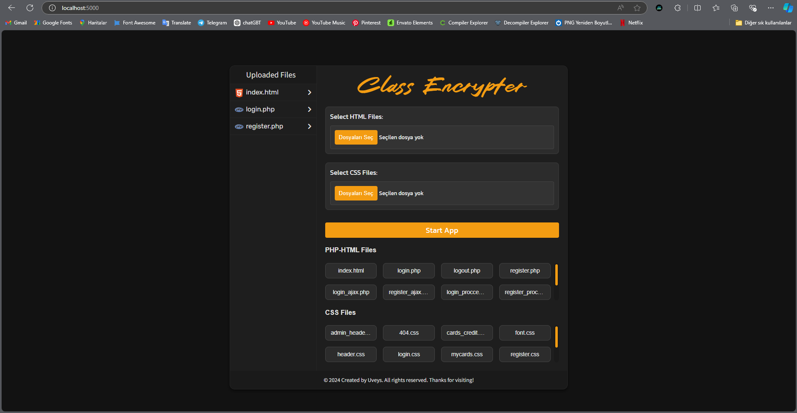

## 🔐 Explanation

Encrypts the names of classes in CSS files used in HTML and PHP files.

## ⚙️ Setup

To run your project on your local machine, follow these steps:

### 🛠️ Requirements

- Python 3.x
- **Flask:** Web application framework. `Flask==2.3.2`
- **Werkzeug:** WSGI library used with Flask. `werkzeug==2.3.2`
- **BeautifulSoup4:** Library for parsing HTML and XML. `beautifulsoup4==4.12.2`
- **Chardet:** Library for detecting character encodings. `chardet==5.1.0`

### 🚀 Steps

1. **Clone this repository**: Open a terminal and run:
   ```bash
   git clone https://github.com/Uveys-Yakut/class-encrypter.git
2. **Navigate to the Project Directory**: Install the required Python packages: 
   ```bash
   pip install -r requirements.txt
3. **Start the Application**: Run the application using:
   ```bash
   python app.py

## 📸 Screenshots



